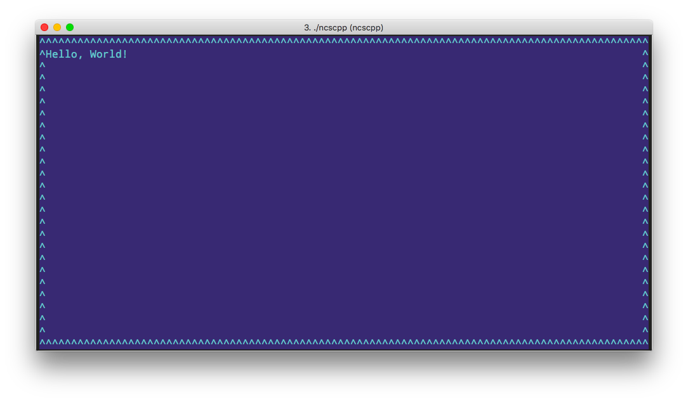

# C++ Playground

 A playground for testing and playing with C++ snippet.

N.B. Clang-tidy will be run on all source files at build time.

## Usage

Either add a file in ```src/```or a full mini project in a subfolder to ```src/```.

## Compiling

```bash
mkdir build && cd build
cmake ...
build
```

### Verbose build

```bash
mkdir build && cd build
cmake -DCMAKE_VERBOSE_MAKEFILE:BOOL=ON ..
make
```

### Debug build

```bash
mkdir build && cd build
cmake -DCMAKE_BUILD_TYPE=Debug ..
make
```


## Programs/projects

### helloworld.cpp

The mandatory hello world sample. Pretty useless..

### extra/

A slightly larger test, containing several cpp/h files and a separate CMakeLists.txt. Will build to a single executable.

### clioptions/

Demoing boost::program_options

### curses

#### ncs/

Trying terminal gui with curses.

Enter text and press enter, esc to quit!

#### cppcurses/

Trying [this](https://github.com/a-n-t-h-o-n-y/CPPurses) c++ wrapper to curses, unfortunately it renders a bit funny in my terminal and I really don't care enough to find a fix right now.. :unamused:



Require that CPPurses is [installed](https://github.com/a-n-t-h-o-n-y/CPPurses#build-instructions) is installed as system lib.

#### ncursescpp

Trying [NcursesCPP](https://github.com/Praetonus/Ncursescpp), pretty nice C++ wrapper around curses. I am, however finding it tricky to read non alphanumeric keys (e.g. esc etc.). Also, the documentation is a bit on the thin side!

Note that this requires a fairly resent curses lib, and the default macos is not working, try installing the latest brew package and set the LDFLAGS and CXXFLAGS indicated by the install script!

#### cursesp/

Using the native curses c++ wrappers. Works pretty good acutally and seems to be very usefull.

Can be a bit sensitive how the lib is linked to the executable, I kept getting seg faults for quite some time until I realized I was linking to both the standrad curses lib as well as the C++ wrapper..

Note that this project is using my [redeo](https://github.com/frklan/libredeo) lib, cmake file just assume it's available in the link path..

#### ctimer/

Second test with the native ncurses C++ wrapper, this time I'm a bit more carefull how I've strutured the classes. The goal is to migrate this into a new version of my [egg](https://github.com/frklan/egg) timer.

### noconvert/

Testing how to do explicit converion of class members when passing them as parameters to functions.

### sscanf/

Testing '%m' fromatiing code that seems to not be in the official ISO standard and hence lacks in many libc implementations.

n.b. this is a c project.

### switch/

Testing case ranges.

### crtp/

Playing with CRTP. Mostly from [this](https://gallery.mailchimp.com/9f01739d94fc2e23b2f359cb0/files/e05f9d5a-331e-4b0e-aa47-4c1cddef5282/CRTP.pdf)

### morse/

a small text to morse code encoder. Playing with std::functions as callbacks.

### streams/

Learning how to sit at the receiving end of a stream.

### operator/

Having fun with operator overloading

### object-passing

Passing object back and forth to see when stuff is copied and when it's moved.

### ascii-tables

playing with [libfort](https://github.com/seleznevae/libfort)

## Contributing

Contributions are always welcome!

When contributing to this repository, please first discuss the change you wish to make via the issue tracker, email, or any other method with the owner of this repository before making a change.

Please note that we have a code of conduct, you are required to follow it in all your interactions with the project.

## Versioning

We use [SemVer](http://semver.org/) for versioning. For the versions available, see the [tags on this repository](https://github.com/frklan/[TBD]/tags).

## Authors

* **Fredrik Andersson** - *Initial work* - [frklan](https://github.com/frklan)

## License

This project is licensed under the MIT License - see the [LICENSE](LICENSE) file for details
