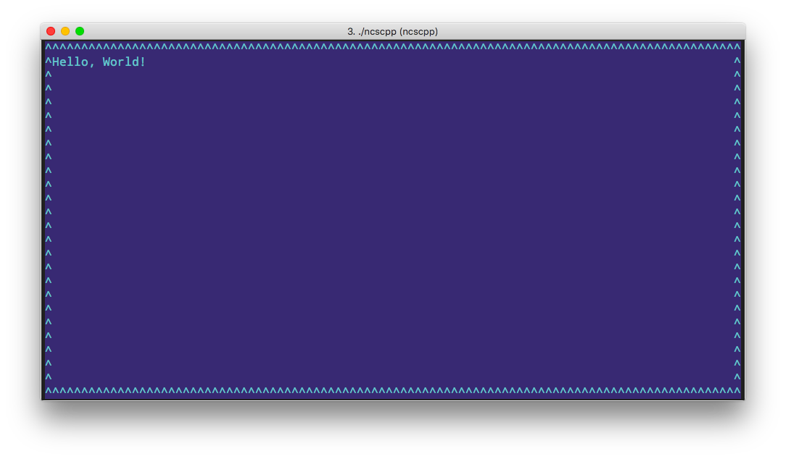

# C++ Playground

 A playground for testing and playing with C++ snippet.

N.B. Clang-tidy will be run on all source files at build time.

## Usage

Either add a file in ```src/```or a full mini project in a subfolder to ```src/```.

## Compiling

```bash
mkdir build && cd build
cmake ...
build
```

### Verbose build

```bash
mkdir build && cd build
cmake -DCMAKE_VERBOSE_MAKEFILE:BOOL=ON ..
make
```

### Debug build

```bash
mkdir build && cd build
cmake -DCMAKE_BUILD_TYPE=Debug ..
make
```


## Programs/projects

### helloworld.cpp

The mandatory hello world sample. Pretty useless..


### clioptions/

Demoing boost::program_options


### extra/

A slightly larger test, containing several cpp/h files and a separate CMakeLists.txt. Will build to a single executable.

### ncs/

Trying terminal gui with curses.

Enter text and press enter, esc to quit!

### ncs-cpp

Trying [this](https://github.com/a-n-t-h-o-n-y/CPPurses) c++ wrapper to curses, unfortunately it renders a bit funny in my terminal and I really don't care enough to find a fix right now.. :unamused:



Require that CPPurses is [installed](https://github.com/a-n-t-h-o-n-y/CPPurses#build-instructions) is installed as system lib.

### ncursescpp

Trying [NcursesCPP](https://github.com/Praetonus/Ncursescpp), pretty nice C++ wrapper around curses. I am, however finding it tricky to read non alphanumeric keys (e.g. esc etc.). Also, the documentation is a bit on the thin side!

Note that this requires a fairly resent curses lib, and the default macos is not working, try installing the latest brew package and set the LDFLAGS and CXXFLAGS indicated by the install script!

### sscanf/

Testing '%m' fromatiing code that seems to not be in the official ISO standard and hence lacks in many libc implementations.

n.b. this is a c project.

## Contributing

Contributions are always welcome!

When contributing to this repository, please first discuss the change you wish to make via the issue tracker, email, or any other method with the owner of this repository before making a change.

Please note that we have a code of conduct, you are required to follow it in all your interactions with the project.

## Versioning

We use [SemVer](http://semver.org/) for versioning. For the versions available, see the [tags on this repository](https://github.com/frklan/[TBD]/tags).

## Authors

* **Fredrik Andersson** - *Initial work* - [frklan](https://github.com/frklan)

## License

This project is licensed under the MIT License - see the [LICENSE](LICENSE) file for details
